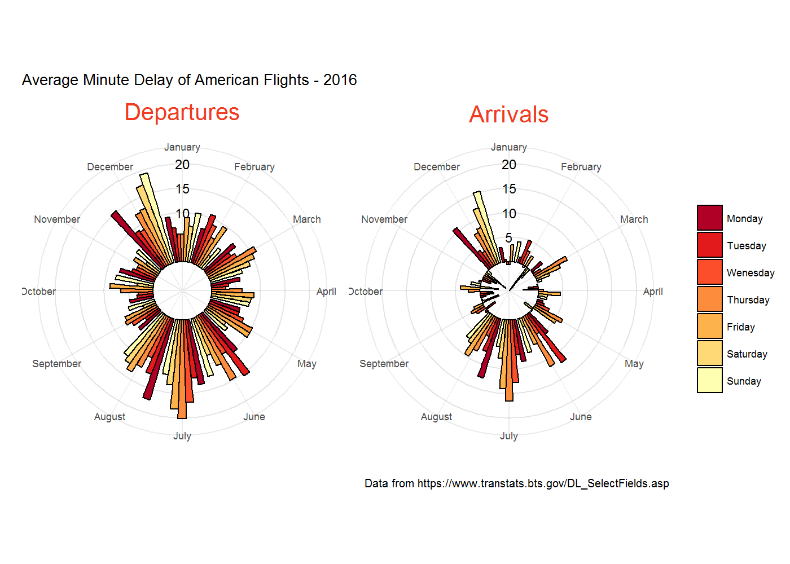

# Fun data: open data that is fun to analyse


Jeremy Singer-Vine sends out a [newsletter](https://tinyletter.com/data-is-plural) every week where he highlights a number of interesting open datasets (you can explore all the datasets [here](https://docs.google.com/spreadsheets/d/1wZhPLMCHKJvwOkP4juclhjFgqIY8fQFMemwKL2c64vk/edit#gid=0)). At Mango we are all for open data so we thought we would also share some of the open datasets we think are fun to explore.  

### Open Food Facts
[Open Food Facts](https://world.openfoodfacts.org/) is a collaborative, free and open database of food products. It is a prime example of how effective crowdsourcing your data is. People from around the world have collected details about more than 300.000 food products and uploaded the information through mobile apps. The data is available as a MongoDB dump, CSV export and an experimental API. We have downloaded the CSV export and will try to visualise the ingredients across all products.


```r
# http://world.openfoodfacts.org/data/en.openfoodfacts.org.products.csv
foodFacts <- read_tsv("data/en.openfoodfacts.org.products.csv")
dim(foodFacts)
## [1] 295958    162
```


```r
library(stringr)
ingredients <- foodFacts %>%
  # ideally, the unnest_tokens function is what we want but it was too slow
  #tidytext::unnest_tokens(ingredient, ingredients_text,
  #                        token = stringr::str_split, pattern=",|\\(|\\)|\\[|\\]") %>%
  # so instead we chose a different approach involving transmute and unlist
  # transmute will give us a list-column
  transmute(ingredients = str_split(ingredients_text, pattern=",|\\(|\\)|\\[|\\]")) %>%
  # unlist will convert the list-column into a character vector
  unlist() %>%
  # enframe will convert the vector into a data frame which is easier to groupby
  enframe() %>%
  # now we clean up some of the text
  mutate(value = str_replace(value, "org|organic", ""),
         value = str_replace(value, "-> en:\\w+", ""),
         value = str_replace_all(value, "'", ""),
         value = str_trim(value)) %>%
  # and finally filter some of the weirder entries
  filter(value!="", value!=".",
         !str_detect(value, "completed|\\d")) %>%
  # to then group by and count the ingredients
  count(value) %>%
  arrange(desc(n))
head(ingredients, 10)
```

```
## # A tibble: 10 x 2
##          value      n
##          <chr>  <int>
##  1        salt 122183
##  2       sugar  88463
##  3       water  80037
##  4         sel  38852
##  5       sucre  29971
##  6         eau  28502
##  7 citric acid  28475
##  8  riboflavin  21527
##  9        milk  21265
## 10      niacin  21201
```

There are no surprises at the top but further down there are a few ingredients that are odd. Let's create a word cloud to show the relative frequencies.


```r
library(wordcloud)
top100 <- head(ingredients, 100)
wordcloud::wordcloud(top100$value, top100$n)
```


Ingredients are only one aspect of this very interesting dataset. We could go on and look at the co-occurrence  of certain ingredients (using network analysis) and then continue analysing their quantities. We could also include the data on nutritional value and calculate correlations. The data could also use some more cleaning considering there are some ingredients in different languages (e.g. water and eau).

### Food prices
Following in the edible theme, [VAM](http://vam.wfp.org/) collate commodity prices from the globe's poorer nations and use them in helping to
identify food insecurity hotspots. The data we will be using can be downloaded [here](https://data.humdata.org/dataset/wfp-food-prices),
from which we'll attempt to visualise how prices have changed over the past 20 years.


```r
# https://data.humdata.org/dataset/wfp-food-prices
#Providing column names and types to make workings easier later on
colnames <- c("Country_ID", "Country", "Region_ID", "Region", "Market_ID", "Market", 
              "Commodity_ID", "Commodity", "Currency_ID", "Currency", "Sector_ID", "Sector",
              "Units_ID", "Units", "Month", "Year", "Price", "Commodity_Source")
coltypes <- cols(Year = "n", Price = "n", Month = "n")
foodPrices <- read_csv("data/FoodPrices/WFPVAM_FoodPrices_13-03-2017.csv", 
                       col_names = colnames,
                       col_types = coltypes) %>%
  filter(row_number() != 1)

#Large number of commodities - won't be able to plot them all!
length(unique(foodPrices$Commodity))
## [1] 304
```


```r
#Overall price trend - trend of all commodity prices over time
overallPriceTrend <- foodPrices %>%
  group_by(Commodity, Year) %>%
  #As different commodities will clearly have different prices, we'll make
  #them comparable by scaling based on their max price within our timeframe
  summarise(globalAveragePrice = mean(Price)/max(Price))

#Food prices trend over time, grouped by commodity - same as above, 
#this time selecting a smaller sample for plotting
commodoties <- c("Wheat", "Milk", "Coffee", "Bananas", "Sugar")
priceTrend <- foodPrices %>%
  select(Price, Commodity, Year) %>%
  #selecting our reduced commodities
  filter(Commodity %in% commodoties) %>%
  group_by(Commodity, Year) %>%
  summarise(globalAveragePrice = mean(Price)/max(Price))

priceTrend
```

```
## # A tibble: 77 x 3
## # Groups:   Commodity [?]
##    Commodity  Year globalAveragePrice
##        <chr> <dbl>              <dbl>
##  1   Bananas  2008          1.0000000
##  2   Bananas  2009          0.4487272
##  3   Bananas  2010          0.1727820
##  4   Bananas  2011          0.2909874
##  5   Bananas  2012          0.4470188
##  6   Bananas  2013          0.1271515
##  7   Bananas  2014          0.1263784
##  8   Bananas  2015          0.1129815
##  9   Bananas  2016          0.2050480
## 10   Bananas  2017          0.2630983
## # ... with 67 more rows
```
We can see what our data looks like for each commodity.

Now let's create a graphic.

```r
library(forcats)
#We'll create a ggplot graphic, using geom_smooth
#Specify some colours semi-related to their genuine appearence
colours <- c("Bananas" = "#fea814", "Coffee" = "#383838", "Sugar" = "#4fcfff", 
             "Milk" = "#cccccc", "Wheat" = "#005692")
#Specify commodity levels for use in our legend
fctLevels <- c("Coffee", "Bananas", "Milk", "Sugar", "Wheat")
ggplot(priceTrend, aes(x = Year, y = globalAveragePrice)) +
  geom_smooth(aes(colour = fct_relevel(Commodity, fctLevels)), se = FALSE, size = 1.8, linetype = 5) +
  geom_smooth(data = overallPriceTrend, colour = "red", se = FALSE, size = 3.5) +
  geom_line(aes(size = "All Commodities", linetype = NA), colour = "red") +
  scale_colour_manual(values = colours) +
  scale_x_continuous(breaks = seq(1992, 2017, 2)) +
  scale_y_continuous(limits = c(0, 1), labels = c("Min", "Max"), breaks = c(0, 1)) +
  labs(title = "Average Global Commodity Prices over Time",
       subtitle = "Commodity Price Relative to Max in Period",
       caption = "Data from https://data.humdata.org/dataset/wfp-food-prices",
       x = "", 
       y = "",
       colour = "Commodity",
       size = "") +
  theme_classic()
```


The trend for our selected commodities seems to show a gradual decrease in prices, as all but coffee and milk prices are now lower than
at the beginning of our timeframe. This is somewhat reflected in our overall price trend, as we can see there has been a slight downward trend, although this has been somewhat negated in the past three years.

In our analysis we took only a mere peek into the dataset. For example, we could look at seasonality trends, subset by country or region or even by market. Indeed it could be taken a step further, as VAM have, and be used as a tool for predicting when and where food security will
occur in the future.

### North Korea Missile Attacks
The next dataset is from the James Martin Center for Nonproliferation Studies (CNS) North Korea Missile Test Database. We agree it's not a fun topic but we also wanted to show the breadth of open data that is out there. You can get the data as an [Excel file](https://www.nti.org/documents/2137/north_korea_missile_test_database.xlsx) but it is also hosted on [data.world](https://data.world/ian/the-cns-north-korea-missile-test-database). And fortunately for the R community data.world have a R package to access their API.   


```r
library(data.world)
# We've set the configuration in a previous session
path <- "ian/the-cns-north-korea-missile-test-database"
missiles <- query(qry_sql("SELECT f1, facility_latitude, facility_longitude, 
                          distance_travelled_km, facility_name 
                          FROM missile_tests 
                          WHERE success='Success'"), 
                  path)
# additional filtering outside of query
missiles <- missiles %>% 
  filter(distance_travelled_km!="Unknown", distance_travelled_km!="N/A") %>% 
  drop_na() %>% 
  mutate(distance_travelled_km = as.integer(distance_travelled_km),
         facility_name = substr(facility_name, 0, 20))
head(missiles)
```

```
## # A tibble: 6 x 5
##      f1 facility_latitude facility_longitude distance_travelled_km
##   <int>             <dbl>              <dbl>                 <int>
## 1   101          39.65960           124.7057                  1000
## 2   102          39.65960           124.7057                  1000
## 3    12          40.85000           129.6667                   500
## 4    40          38.99083           127.6236                   200
## 5    41          38.99083           127.6236                   200
## 6    42          38.99083           127.6236                   200
## # ... with 1 more variables: facility_name <chr>
```

The data contains information on the launch location but not on the precise location of where the missile landed. However we can use the distance travelled to approximate this by calculating a radius.


```r
# slightly adapted from https://stackoverflow.com/questions/34183049/plot-circle-with-a-certain-radius-around-point-on-a-map-in-ggplot2#34187454

# drop duplicate locations and distances
dups <- duplicated(missiles %>% select(facility_name, distance_travelled_km))
missiles <- missiles %>% filter(!dups)

# define the circle we want for each missile
circles <- data_frame(f1 = rep(missiles$f1, each = 100),
                      angle = rep(seq(0, 2*pi, length.out = 100), nrow(missiles)))

meanLatitude <- mean(missiles$facility_latitude)

missile_circles <- missiles %>% 
  # length per longitude changes with latitude, so need correction
  mutate(radiusLon = distance_travelled_km/111/cos(meanLatitude/57.3),
         radiusLat = distance_travelled_km/111) %>% 
  left_join(circles) %>% 
  mutate(longitude = facility_longitude + radiusLon * cos(angle),
         latitude = facility_latitude + radiusLat * sin(angle))
```

So now we have our circles we can plot them on a map.


```r
library(ggmap)
nk = get_map(location = c(lon = mean(missile_circles$facility_longitude), 
                          lat = mean(missile_circles$facility_latitude)), 
             zoom = 5, maptype = "terrain")
ggmap(nk, extent = "panel") + 
  geom_point(aes(x = facility_longitude, y = facility_latitude, colour=facility_name), 
             data = missiles) +
  ########### add circles
  geom_polygon(data = missile_circles, aes(longitude, latitude, group = f1, 
                                           colour=facility_name), alpha = 0)
```


These are obviously not missile ranges and none of the missiles will have gone over China. The CNS have also created [visualisations](http://www.nti.org/analysis/articles/cns-north-korea-missile-test-database/) with this data and from that we can see that the time dimension is important. That is something we could add to our visualisation or we could perform more analyses on the success/fail dimension.   

### Flight Delays
The [Bureau of Transportation Statistics](https://www.bts.gov/) are a leading source of U.S. transportation systems data, helping
to shape transportation policy and research projects across the US. We pulled through their [data](https://www.transtats.bts.gov/DL_SelectFields.asp), selecting the Month and DayOfWeek fields, as well as Departure and Arrival delays. The site only allows us to download data one month at a time, so we need to begin by reading in 12 files to a list and binding
them together.


```r
# https://www.transtats.bts.gov/DL_SelectFields.asp
#Month files were downloaded to separate csvs, so we'll read them in and combine them
files <- list.files(path = "data/FlightData/", pattern = "*.csv", full.names = TRUE)
flightsRaw <- map_df(files, read_csv)
```

Now lets recode our Months and Weekdays to be character names, rather than just integers. Then we can prepare our data for plotting. In
this plot, we'll be aiming to plot the difference between departure and arrival delays, grouped by Weekday and Month.

```r
#Begin by renaming integer values to days of the week and months
flightData <- flightsRaw %>%
  mutate(DAY_OF_WEEK = as.factor(DAY_OF_WEEK),
         DAY_OF_WEEK = fct_recode(DAY_OF_WEEK, Monday = "1", Tuesday = "2", Wenesday = "3",
                              Thursday = "4", Friday = "5", Saturday = "6", Sunday = "7"),
         MONTH = as.factor(MONTH),
         MONTH = fct_recode(MONTH, January = "1", February = "2", March = "3", April = "4",
                            May = "5", June = "6", July = "7", August = "8", September = "9",
                            October = "10", November = "11", December = "12"))

#Summarise the data to show the mean delay/arrival time split by Month and Weekday
monthDayDelays <- flightData %>%
  select(DEP_DELAY, ARR_DELAY, MONTH, DAY_OF_WEEK) %>%
  group_by(MONTH, DAY_OF_WEEK) %>%
  #Calculate means split by Month and Weekday
  summarise(Departures = mean(DEP_DELAY, na.rm = TRUE), Arrivals = mean(ARR_DELAY, na.rm = TRUE)) %>%
  filter(!is.na(MONTH)) %>%
  ungroup() %>%
  #Gather our data so Depature and Arrival delay times are stored within one column
  gather(key = delayType, value = Delay, Arrivals, Departures) %>%
  #Reorder Departure/Arrival factors so Depatures appear first in our graphic
  mutate(delayType = fct_rev(delayType))
monthDayDelays
```

```
## # A tibble: 140 x 4
##       MONTH DAY_OF_WEEK delayType       Delay
##      <fctr>      <fctr>    <fctr>       <dbl>
##  1  January      Monday  Arrivals  3.08526171
##  2  January     Tuesday  Arrivals  0.49934650
##  3  January    Wenesday  Arrivals -0.64372809
##  4  January    Thursday  Arrivals -0.61050874
##  5  January      Friday  Arrivals  3.37778214
##  6  January    Saturday  Arrivals  0.05099645
##  7  January      Sunday  Arrivals  4.17985079
##  8 February      Monday  Arrivals  1.30443327
##  9 February     Tuesday  Arrivals  5.09620906
## 10 February    Wenesday  Arrivals  3.00267779
## # ... with 130 more rows
```
We now have our Delay times in one column, with delayType either arrival or departure. We also have our Month and Weekday columns for 
grouping our data in the plot.

Now let's create a graphic. Note, the colours used for our graphic were obtained from [Color Brewer 2.0](http://colorbrewer2.org).

```r
#Specify colours vector for use in scale_fill_manual.
colours <- c("#ffffb2", "#fed976", "#feb24c", "#fd8d3c", "#fc4e2a", "#e31a1c", "#b10026")
#Graphic
ggplot(monthDayDelays, aes(x = MONTH, y = Delay)) +
  #Adding reference lines to our (soon to become) circular chart
  geom_hline(yintercept = seq(0, 20, by = 5), alpha = 0.1) +
  #Bars for every day of the week grouped by month
  geom_bar(stat = "identity", aes(fill = DAY_OF_WEEK), position = "dodge", colour = "black") +
  #This bit is hacky. To get a single label to appear on our reference lines at zero degrees, we select a
  #single datapoint from January (Month at zero degrees) and use it as our data argument.
  #monthDayDelays[1, ] is a datapoint for mean Arrival time in January 
  geom_text(data = monthDayDelays[1, ], y = 5, label = "5", size = 3) +
  geom_text(data = monthDayDelays[1, ], y = 10, label = "10", size = 3) +
  geom_text(data = monthDayDelays[1, ], y = 15, label = "15", size = 3) +
  geom_text(data = monthDayDelays[1, ], y = 20, label = "20", size = 3) +
  #monthDayDelays[85, ] is a datapoint for mean Departure time in January 
  geom_text(data = monthDayDelays[85, ], y = 10, label = "10", size = 3) +
  geom_text(data = monthDayDelays[85, ], y = 15, label = "15", size = 3) +
  geom_text(data = monthDayDelays[85, ], y = 20, label = "20", size = 3) +
  #Specify colours for chart
  scale_fill_manual(values = rev(colours)) + 
  #Remove yAxis scale from side of plot
  scale_y_continuous(breaks = NULL) +
  #Make plot circular, starting at due north
  coord_polar(theta = "x", start = -pi/12) + 
  #Separate our departure and arrival plots
  facet_wrap(~delayType, labeller = label_parsed) +
  #Add labels
  labs(title = "Average Minute Delay of American Flights - 2016",
       x = "",
       y = "", 
       fill = "",
       caption = "Data from https://www.transtats.bts.gov/DL_SelectFields.asp") +
  theme_minimal(base_size = 8) +
  #Make our facet titles pretty
  theme(strip.text.x = element_text(size = 15, colour = "#f03b20"))
```



Interestingly, we can see that even if your flight is delayed, you can expect that delay to have reduced upon arrival. In fact,
on average 5 minutes and 25 seconds will be recovered during air time.

Perhaps not so interestingly, we can see that the months with the longest delays fall in the summer and winter holidays. Conversely,
if you're not bound by school holidays, November looks to be an excellent time to travel, as you can expect to arrive a whole
2 minutes early!

Again with this analysis, there are many more pathways we could explore. For example, [FiveThirtyEight](https://projects.fivethirtyeight.com/flights/) have produced a similar delay chart, only this time grouped by airport. This, when combined with our brief analysis, makes your dream, undelayed, vacation a possible reality!!

This blogpost turned out longer than we expected but that's what happens when you have fun. If you have a cool dataset that's fun to analyse let us know on [twitter](https://twitter.com/MangotheCat). You can find the code for this blogpost on [GitHub](https://github.com/MangoTheCat/blog_fun_data). 
