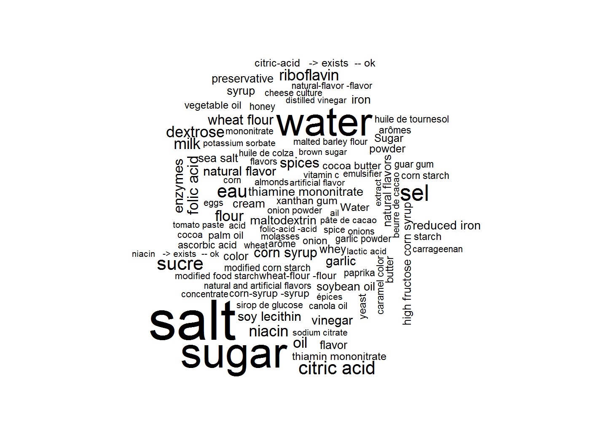

# Fun data: open data that is fun to analyse


Jeremy Singer-Vine sends out a [newsletter](https://tinyletter.com/data-is-plural) every week where he highlights a number of interesting open datasets (you can explore all the datasets [here](https://docs.google.com/spreadsheets/d/1wZhPLMCHKJvwOkP4juclhjFgqIY8fQFMemwKL2c64vk/edit#gid=0)). At Mango we are all for open data so we thought we would also share some of the open datasets we think are fun to explore.  

### Open Food Facts
[Open Food Facts](https://world.openfoodfacts.org/) is a collaborative, free and open database of food products. It is a prime example of how effective crowdsourcing your data is. People from around the world have collected details about more than 300.000 food products and uploaded the information through mobile apps. The data is available as a MongoDB dump, CSV export and an experimental API. We have downloaded the CSV export and wil try to visualise the ingredients across all products.


```r
# http://world.openfoodfacts.org/data/en.openfoodfacts.org.products.csv
foodFacts <- readr::read_tsv("data/en.openfoodfacts.org.products.csv")
dim(foodFacts)
## [1] 295958    162
```

```r
ingredients <- foodFacts %>%
  # ideally, the unnest_tokens function is what we want but it was too slow
  #tidytext::unnest_tokens(ingredient, ingredients_text,
  #                        token = stringr::str_split, pattern=",|\\(|\\)|\\[|\\]") %>%
  # so instead we chose a different approach involving transmute and unlist
  # transmute will give us a list-column
  transmute(ingredients = stringr::str_split(ingredients_text, pattern=",|\\(|\\)|\\[|\\]")) %>%
  # unlist will convert the list-column into a character vector
  unlist() %>%
  # enframe will convert the vector into a data frame which is easier to groupby
  enframe() %>%
  # now we clean up some of the text
  mutate(value = stringr::str_replace(value, "org|organic", ""),
         value = stringr::str_replace(value, "-> en:\\w+", ""),
         value = stringr::str_replace_all(value, "'", ""),
         value = stringr::str_trim(value)) %>%
  # and finally filter some of the weirder entries
  filter(value!="", value!=".",
         !stringr::str_detect(value, "completed|\\d")) %>%
  # to then group by and count the ingredients
  count(value) %>%
  arrange(desc(n))
head(ingredients, 10)
```

```
## # A tibble: 10 x 2
##          value      n
##          <chr>  <int>
##  1        salt 122183
##  2       sugar  88463
##  3       water  80037
##  4         sel  38852
##  5       sucre  29971
##  6         eau  28502
##  7 citric acid  28475
##  8  riboflavin  21527
##  9        milk  21265
## 10      niacin  21201
```

There are no surprises at the top but further down there are a few ingredients that are odd. Let's create a word cloud to show the relative frequencies.


```r
library(wordcloud)
top100 <- head(ingredients, 100)
wordcloud::wordcloud(top100$value, top100$n)
```

<!-- -->

Ingredients are only one aspect of this very interesting dataset. We could go on and look at the co-occurence of certain ingredients (using network analysis) and then continue analysing their quantities. We could also include the data on nutritional value and calculate correlations. The data could also use some more cleaning considering there some ingredients in different languages (e.g. water and eau).

### North Korea Missile Attacks


